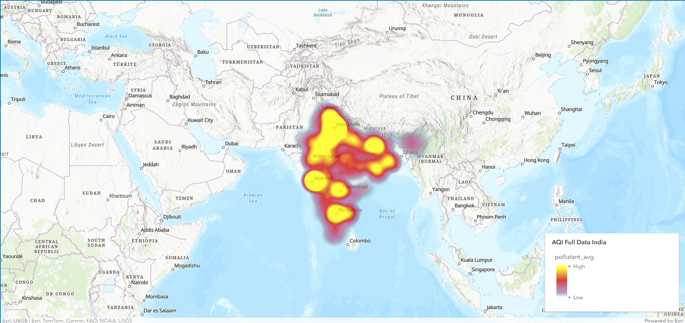

# Antriksh

NASA Space Apps Noida submission.

# Idea

The goal of this project is to provide an interactive, data-driven visualization of industrial pollution in India. By mapping the locations of various polluting factories and layering this information with historical Air Quality Index (AQI) data from different monitoring stations, we aim to highlight the environmental impact of these industries on surrounding regions.

The map offers a visual representation of pollution patterns, helping users understand the relationship between factory locations and air quality over time. This tool can be valuable for policymakers, researchers, and environmental advocates looking to assess pollution hotspots and identify areas that require intervention.

We hope that by making this information more accessible and interactive, the project can foster greater awareness of industrial pollution and its tangible effects on air quality in India.

## Screenshots
